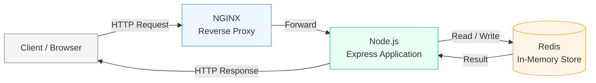

# WorkFlow

This document explains how **ShortLink** behaves at runtime. It focuses on request flow, data movement, and component responsibilities without exposing internal configuration or infrastructure syntax.

---

## System Overview

ShortLink is a request-driven service with a simple contract:

* Accept a long URL
* Generate or accept a short alias
* Persist the mapping
* Redirect clients with minimal latency

The system is intentionally stateless at the application layer. All stateful concerns are externalized.

---

## URL Shortening Flow

### Step-by-Step

1. **Client Request**

   * A client sends a request to shorten a URL.

2. **NGINX Entry Point**

   * NGINX receives the request and forwards it to the application.

3. **Express Application**

   * Validates input
   * Generates or verifies the short alias
   * Applies rate limiting rules

4. **Redis Storage**

   * Stores the short alias → long URL mapping
   * May store metadata such as timestamps or counters

5. **Response**

   * The application returns the shortened URL to the client.

This path is optimized for write correctness rather than extreme throughput, as writes are less frequent than reads.

---

## Redirect Flow

### Step-by-Step

1. **Browser Request**

   * A browser requests a short URL.

2. **NGINX Reverse Proxy**

   * Routes the request to the application layer.

3. **Express Resolution**

   * Extracts the short alias
   * Performs minimal validation

4. **Redis Lookup**

   * Retrieves the corresponding long URL
   * Lookup is constant-time and memory-resident

5. **HTTP Redirect**

   * A `302` or `301` redirect is returned to the client.

This flow is latency-critical and optimized for speed.

---

## Caching & State

Redis serves as the system’s single source of truth for URL mappings at runtime.

* No in-memory application cache is required
* Application containers can be restarted without data loss
* Horizontal scaling does not require session affinity

This design enables aggressive scaling without coordination between instances.

---

## Stateless Application Design

The Node.js application is stateless by design:

* No local persistence
* No sticky sessions
* No dependency on instance identity

This allows:

* Rolling deployments
* Fast container replacement
* Simple autoscaling strategies

---

## Failure Behavior

ShortLink is designed to fail predictably:

* If Redis is unavailable, redirects fail fast
* If the application crashes, NGINX routes to healthy instances
* If an instance is terminated, no data is lost

Failures surface clearly rather than silently degrading correctness.

---

## Why This Design Works

* Reads are fast and isolated
* Writes are validated and controlled
* Infrastructure concerns are separated from logic
* Observability is externalized

The result is a system that is simple to reason about, even under load or failure.

---
